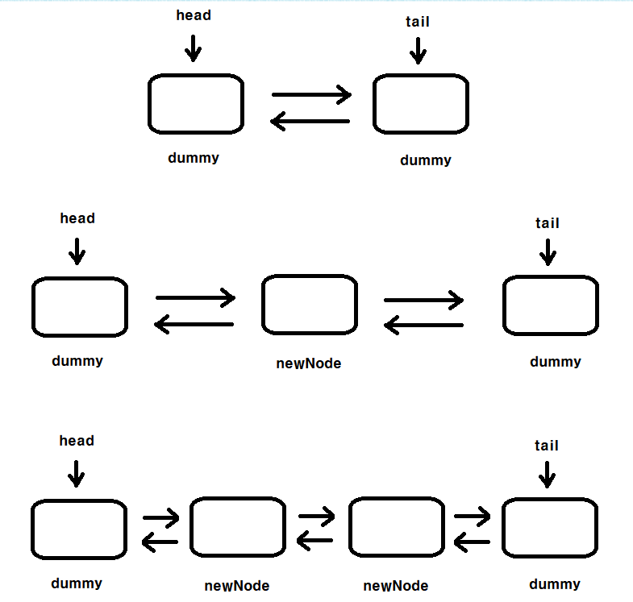
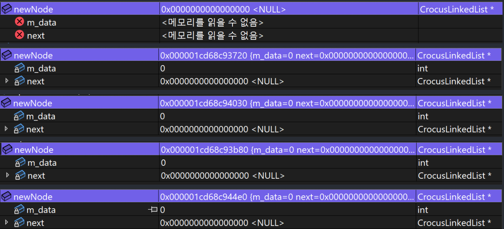

<style>
.imgOption{
    display:flex;
    justify-content:center;
    align-items:center;
    height: 600px; 
}

.inverse {
    filter : invert(85%);
}

h2{
    font-weight :bold;
    border : 6px solid yellow;
    color : yellow !important;
}
h3 {
    font-weight :bold;
    border : 3px solid ;
}
</style>

<!--##### 👉 트로미노란? -->

## 배열과 연결리스트
### Quest
#### ❗ 배열과 연결리스트의 차이
*
    |___|배열|연결리스트|
    |--|:--|:--|:--|
    |형식|정적|동적|
    |접근|random Access : O(1)|Sequential Access : O(N)|
    |삽입|맨앞 O(N)<br>맨뒤 O(1)| 맨앞O(1) <br> 맨뒤 O(N)|
    |삭제|맨앞 O(N)<br>맨뒤 O(1)| 맨앞O(1) <br> 맨뒤 O(N)|

## 연결리스트 
### 1. 더미노드
#### ❗ 더미노드는 왜 쓰는건가?


### 2. 원형 연결리스트
#### ❗ 작동방식
##### 👉 구성은?
* 1. _*list*_->tail
     1. 원형리스트의 마지막임
* 2. _*list*_->tail->next (내지는 head)
     1. 원형리스트의 시작임 
ㅎ
##### 👉 복잡도는?
*
    |___|연결리스트|
    |--|:--|:--|
    |형식|동적|
    |접근|Sequential Access : <br>맨앞 : O(1) <br>맨뒤 : O(N)|
    |삽입|맨뒤 O(1)|
    |삭제|맨앞O(1)|

* ##### [Crocus 원형 연결리스트 (클릭)](C:/Users/offic/source/repos/CrocusClassPractice_연결리스트_1/CrocusClassPractice_연결리스트_1/CircuitLinkedList.cpp)

### 3. 이중 연결리스트
#### ❗ 작동방식
##### 👉 구성은?
* **😈 노드와 노드형식은 서로 다른것이다. 😈**
  * 노드는 data를 지닌 대상
  * 노드형식 포인터는 그냥 화살표
    * 그저 Node형식이라는것은 "노드를 가르키는" 화살표임
<br>
* **1. Node (단일 구성원)**
  * 노드형식 포인터 next
  * 노드형식 포인터 prev
  * data
* **2. List 구성원**
  * 노드형식 포인터 mHead
  * 노드형식 포인터 mTail
  * 노드형식 포인터 mCur
  * length

##### 👉 매서드는?
* **노드 삽입**
  * 첫 생성
    1. mHaed와 mTail은 노드를 가르킨다
    2. 그것은 바로 방금 만들어진 노드이다.
        ```cpp
        mHead = newNode;
        mTail = newNode;
        ```
        * 이 newNode는 방금 메모리 할당받고, 데이터도 넣은것이다.
   1. 그리고 첫 만들어진것의 구조는
      1. 이전노드도 없고
            ```
            mHead->prev = NULL;
            ```
      2. 다음노드도 아직없다.
            ```
		    mTail->next = NULL;
            ```
* **노드 삭제**


    |___|연결리스트|
    |--|:--|:--|
    |형식|동적|
    |접근|Sequential Access : <br>맨앞 : O(1) <br>맨뒤 : O(1) <br>인덱스 : O(N)|
    |삽입|맨앞O(1)<br>맨뒤 O(1)|
    |삭제|맨앞O(1)<br> 맨뒤 O(1)|

* ##### [Crocus 양방향 연결리스트 (클릭)](C:/Users/offic/source/repos/CrocusClassPractice_연결리스트_2/CrocusClassPractice_연결리스트_2/D_List.cpp)

## 설계
### 1. 클래스 (자료형)을 선언했을때
객체생성이 되었다는 증거는 Class 선택자로 이동하는지 안하는지 중단점확인

**ⓐ** : Class classResult
└ 해답 Class 할당이 바로 이루어짐 (객체생성)
				
**ⓑ** : Class * classResult
└ 해답 Class 할당이 아직임 그저 앞으로 할당될 공간을 가르킨다 (객체생성 X) 대신 new를 통하면 객체 생성이 된다 (동적으로)
```
//이건 클래스를 지목하는 포인터일뿐, 경로일뿐이지
//아직 공간이 할당된 상태는 아니다.
//중단점 확인해봐도 new를 해야지만 Crocus 클래스를 이동하는것으로 보인다.
//따라서 *으로 했으면 아직 공간할당이 아니라
//동적으로 메모리를 할당하고 싶거나 해야할때,
//즉, 코드 진행중에 공간할당을 하고 싶을떄
```
### 2. Class * classResult = new Node를 계속한다면.. 
**ⓐ** :  초기에 실행했던 공간만 계속 지목되는건가?
**ⓑ** :  새로운 공간에 생겨서 지목되는건가?




**해답** : ⓑ가 답이다. 근데..
*문제점* : 메모리 헤제는 어떻게 해야되는거지?

근데 다행이 일단 ctrl F5하면 알아서 초기화 되는 모양이다.

### 3. new Node 된것을 delete한다면?
	1. 궁금증2와 더불어 
	2. 누수되는것은 어떻게 되는거?


### 참고
https://www.crocus.co.kr/1179#recentEntries
https://m.blog.naver.com/raylee00/222003225089