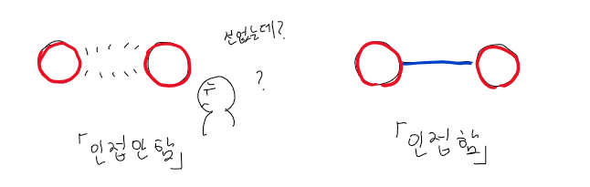
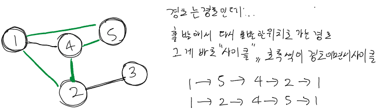
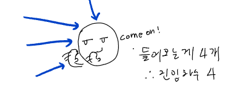

<style>
.imgOption{
    display:flex;
    justify-content:center;
    align-items:center;
    height: 600px; 
}

.inverse {
    filter : invert(85%);
}

h2{
    font-weight :bold;
    border : 6px solid yellow;
    color : yellow !important;
}
h3 {
    font-weight :bold;
    border : 3px solid ;
}
</style>

## 그래프 용어 정리
### 1.  G=(V,E)
* #### G : 그래프 V, E 요소로 이루어진 집합이다.
  * **V *(Vertex or Node)*** : 정점들의 집합
  * **E *(Edge or Line)*** : 간선들의 집합
  * 

* #### 트리와 그래프?
  * 
  * **트리는 사실 그래프의 특수한 형태이다**

### 2. 인접 

#### 1. 인접 (Adjacent)
*  
* 두 정점을 연결한 간선이 있을때 **인접한다** 고 말한다.

#### 2. 차수 (Degree)
* 
* **한 정점과 인접하는 간선개수**

#### 3. 루프 (Loop)
* 
*  **같은 정점을 가르키는 간선 (E)**

### 3. 경로 
#### 1. 경로 (Path)
* 
* **특정 정점에서 다른 정점까지 거치는 (V & E)** 

#### 2. 회로 (Circuit) = Cycle
* 
* **경로의 시작점과 끝점이 같은 Path**

#### 3. 오일러(full 간선) 경로
* 그래프의 **모든 간선들을 꼭 한번씩** 지나는 **경로** 
한붓그리기?
#### 4. 오일러(full 간선) 회로 
* **오일러 경로이면서 회로이여야함**
* 그래프의 **모든 간선들을 꼭 한번씩** 지나는 **회로** 

#### 5. 해밀턴(full 정점) 경로
* **그래프의 모든 정점들을 꼭 한번씩 지나는 경로**

#### 6. 길이 (length)
* 
* 
* **경로에 들어간 정점개수**

### 4. 이분그래프
#### 1. 이분그래프
* 
* 그래프를 **두 부분으로 분할** 했을떄 
**두 분할 사이를 연결하는 간선이 존재하는 그래프**

#### 2. 이분매칭
* 정점을 {a,c} {c,d,e}로 두가지 집합으로 분할하고
두 정점 집합내 정점을 다늘 집합과 인접시키는것  

## 그래프의 분류

### 정점의 방향성

* #### 1. 방향 그래프
  * 정점간 순서가 존재하는 그래프
    * 
  * 진입 차수
    * 
  * 진출 차수
    * 

* #### 2. 양방향(무방향) 그래프
  * 정점간 순서가 없다 1->2 이면서 2->1 인 간선으로 이루어짐
    * 

### 정점의 차수
* #### 완전 그래프
  * **정점(vertex)의 degree = 그래프내부의 정점(vertex) 수 -1**
    **즉, 모든 vertex가 edge 로 연결된 그래프**
  * 

## 그래프 구현법
### 인접행렬
* #### 특징
  1. E 개수만큼 작성
  2. 공간은 V² 만큼 차지
* #### 장단점
  * 장점
    1. 직관적 가중치 저장이 쉽다
       1. true / false로 인접 판단 가능
       2. int 값으로 가중치 저장
  * 단점
    1. 불필요한 정보 저장이 많음
    2. 메모리 초과 발생 가능
* #### 코드
  ```cpp
  #include <iostream>
  #include <algoruthm>
  using namespace std;
  const int MAX = 1e4;

  int G[MAX][MAX = {0,};

  int main(){
      //정점개수, 간선개수
      int V, E; cin >> V >> E;
      for(int i = 0;  i < E; i++){
          int u, v; 
          cin >> u >> v;
          //무방향 그래프
          G[u] = v; G[v] = u; 
      }
  }
  ```
* #### 사진
  * 

### 인접 리스트
* #### 특징
  1. 갈수 있는곳만 저장
  2. 공간은 V + E 만큼 저장
* #### 장단점
  * 장점
    1. 메모리 절약 가능
  * 단점
    1. 인접 데이터는 쉽지만
    2. 가중치 데이터를 넣으려면 pair을 사용해야한다.

* #### 코드
  ```cpp
  #include <iostream>
  #include <vector>
  #include <algoruthm>
  using namespace std;
  const int MAX = 1e4;

  vector<int> G[MAX];

  int main(){
      //정점개수, 간선개수
      int V, E; cin >> V >> E;
      for(int i = 0;  i < E; i++){
        int u, v;
        cin >> u >> v;
        G[u].push_bakc(v);
        G[v].push_bakc(u);
      }
  }
  ```

* #### 사진
  * 

## 알고리즘 시간에 만나야 할것들..
### 그래프 탐색법
1. DFS
1. BSF
1. 벨만 포드법
1. 다익스트라

### 최소 스패닝 트리
1. 프림
1. 크루스칼
   * 사이클 여부