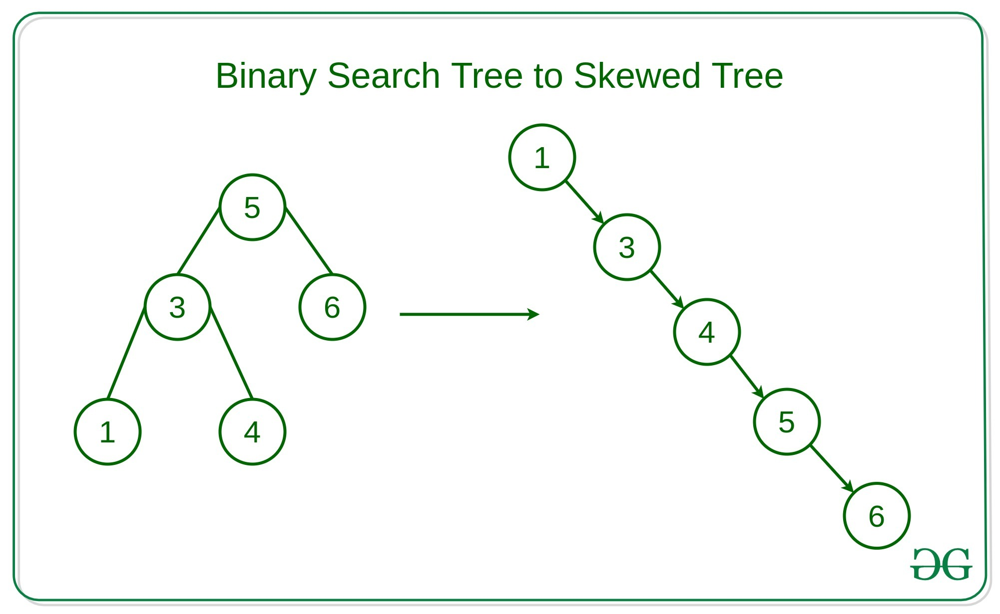

<style>
.imgOption{
    display:flex;
    justify-content:center;
    align-items:center;
    height: 600px; 
}

.inverse {
    filter : invert(85%);
}

h2{
    font-weight :bold;
    border : 6px solid yellow;
    color : yellow !important;
}
h3 {
    font-weight :bold;
    border : 3px solid ;
}
</style>

<!--##### 👉 트로미노란? -->

## 트리
### 트리의 구성 요소
##### ❗ 기본 트리의 구성 요소
* **노드** 
* **간선** 
  * 노드와 노드를 연결하는선
* **서브 트리** 
  * 트리를 구성하는 작은 트리
  * 트리는 재귀적이다.

##### ❗ 관점에 따른 노드 분류
<div style="clear : both; display:inline-block; height=300px; border : 1px solid #fff; box-sizing : box-">
  
  <div>
    <ul>
        <li><strong>👉 위치에 대한 관점</strong></li>
        <ul>
            <li>
                <strong>루트 노드</strong>
                <div>
                   ■ 맨 꼭데기 노드
                </div>
            </li>
            <li>
                <strong>단말 노드</strong>
                <div>
                   ■ 자식이 없는 노드
                </div>
            </li>
            <li>
                <strong>내부 노드</strong>
                <div>
                   ■ 단말 노드 이외 노드
                </div>
            </li>
        </ul>
    </ul>
  </div>
</div>


<div style="clear : both; display:inline-block; height=300px; border : 1px solid #fff; box-sizing : box-">
  
  <div>
    <ul>
        <li><strong>👉 상위, 하위 관점</strong></li>
        <ul>
            <li>
                <strong>부모 노드</strong>
                <div>
                   ■ 자식을 가지고 있는노드
                </div>
            </li>
            <li>
                <strong>자식 노드</strong>
                <div>
                   ■ 부모가 있는 노드
                </div>
            </li>
            <li>
                <strong>형제 노드</strong>
                <div>
                   ■ 부모가 있고 Depth가 동일한 노드
                </div>
            </li>
        </ul>
    </ul>
  </div>
</div>

###  트리의 분류
#### ❗ depth / level
* 트리의 깊이혹은 높이라 부른다
* 어떤 트리의 depth / level을 물어볼때 최대 depth를 말하면 된다.
* 가족관계
  * 현재 노드 : i;
  * 부모 : i/2;
  * 왼쪽 : 2i;
  * 오른쪽 : 2i + 1;

##### 👉 이진 트리
* 노드 하나를 중심으로 2개의 서브트리로 나뉘어 지는 트리
* 공집합도 이진트리로 포함해야한다.

|1|2|
|--|--|
|||

##### 👉 완전 이진 트리
* 노드가 좌측부터 채워지는 이진 트리
  ```cpp
  // C++ implementation of tree using array
  // numbering starting from 0 to n-1.
  #include<bits/stdc++.h>
  using namespace std;
  char tree[10];
  int root(char key) {
    if (tree[0] != '\0')
      cout << "Tree already had root";
    else
      tree[0] = key;
    return 0;
  }
  
  int set_left(char key, int parent) {
    if (tree[parent] == '\0')
      cout << "\nCan't set child at"
      << (parent * 2) + 1
      << " , no parent found";
    else
      tree[(parent * 2) + 1] = key;
    return 0;
  }
  
  int set_right(char key, int parent) {
    if (tree[parent] == '\0')
      cout << "\nCan't set child at"
      << (parent * 2) + 2
      << " , no parent found";
    else
      tree[(parent * 2) + 2] = key;
    return 0;
  }
  
  int print_tree() {
    cout << "\n";
    for (int i = 0; i < 10; i++) {
      if (tree[i] != '\0')
        cout << tree[i];
      else
        cout << "-";
    }
    return 0;
  }
  
  // Driver Code
  int main() {
    root('A');
    //insert_left('B',0);
    set_right('C', 0);
    set_left('D', 1);
    set_right('E', 1);
    set_right('F', 2);
    print_tree();
    return 0;
  }
  ```

##### 👉 포화 이진 트리
* depth에 대해 꽉찬 이진 트리

---

### 트리의 운행법
* ##### preorder : M, L, R
* ##### inorder : L, M, R
  * 이진탐색트리에서 중위순회를 하면
  * 오름차순으로 정렬된 순서로 Key를 가져올 수 있음
* ##### postorder : L, R, M

#### ❗ 명칭
* 연산자 
  : +, -, *, /...
* 피연산자
  : A, B, C ...

#### ❗ 수식연산 알고리즘 
##### 👉 1. 전위표기법 (EX. +AB)
* **preorder : M, L, R**
* 연산자를 먼저 표시하고 연산에 필요한
피연산자를 나중에 표기하는 방법

##### 👉 2. 중위 표기법 (EX. A+B)
* **inorder : L, M, R**
* 연산자를 두 피연산자 사이에 표기하는 방법으로
가장 일반적으로 사용되는 방법

##### 👉 3. 후위 표기법 (EX. AB+)
* **postorder : L, R, M**
* 피연산자를 먼저 표시하고 연산자를 
나중에 표시하는 방법

## 이진 탐색트리
https://gist.github.com/harish-r/a7df7ce576dda35c9660

* 
#### 문제점
* 위 두 트리는 각각 이진 탐색 트리가 맞는데..
  * 우측은 Skewed 이진 탐색트리라고 한다..
  * 근데 이렇게 배치되면 사실상 연결리스트랑 다를바가 없다. (비효율)
    * 왜 이런일이 생기냐.. 연달아 큰것들이 들어와서 저렇다
    * 만약 들어오는 순서가 달랐다면 다른 모양이 되었겠지..
      * 인풋 순서에 따라 결정된다.
    * 이것을 해결하기위해 **[레드블랙트리](#레드-블랙-트리)** 사용한다.

### 정의
#### ❗ 이진 트리 기반 자료구조다
* 단 완전 이진트리 형식은 아닐수도 있다
* 들어온 노드에 따라 형태가 배뀌기 떄문이다

#### ❗ 노드간 특징
* **L < M < R**

### 동작
##### 탐색
* 찾으려는값 < 현재 서브트리의 루트
  * 왼쪽 서브트리로 간다.

##### 삽입
* 각 레벨마다 왼쪽 혹은 오른쪽 서브트리를 선택하면서 쭉쭉 내려오다가
* leaf노드에 도달하면 멈추기

##### 삭제
* ***삭제 케이스는 노드 자식에 따라 다르다***
  1. 삭제 노드의 서브트리가 0개
  2. 삭제 노드의 서브트리가 1개
  3. 삭제 노드의 서브트리가 2개

[이진 탐색 트리코드](C:/Users/offic/source/repos/CrocusClassPractice_이진탐색트리_1/CrocusClassPractice_이진탐색트리_1/BinSearchTree.cpp)

## 힙

### 힙의 구성 요소

#### ❗ 힙 정의

##### 👉 완전 이진트리 기반 자료구조
* 최댓값 및 최솟값을 찾아내는 연산을 빠르게 하기위해 고안된 자료구조다
  * 완전 이진트리를 기본으로 한 자료구조다 

##### 👉 노드간 특징
* 부모 노드는 항상 자식노드 값사이 대소관계가 존재한다.
* 단, 형제 노드사이에는 대소관계를 모른다.

##### 👉 배열 VS 힙 (극값 탐색 시간)
|___|배열|힙|
|--|--|--|
|삽입삭제|O(1),O(N)|O(lg), O(lg)|
|극값탐색|O(N)|O(1)|

#### ❗ 힙 종류
https://gist.github.com/jmkim/1920a4ff2ac3cb0252d6a76f3c8d97cc

|**👉 Min-Heap**|**👉Max-Heap**|
|:--|:--|
|||
|부모노드의 키값이 자식노드의 키값보다 항상 큰 힙<br>데이터를 모두 양수라고 하면 max 힙|부모노드의 키값이 자식노드의 키값보다 항상 작은 힙<br> 데이터를 모두 음수 치환하면 min 힙|

### 힙의 동작
|insert|delete|
|:--|:--|
|O(log N)|O(log N)|
|||

**[코드에서 사용하려면...
](http://www.cplusplus.com/reference/queue/priority_queue/)**

```cpp
#include <queue>
struct comp{
    bool operator()(자료형 &A, 자료형 &B){
        return A.--- < B.---;//max힙
        return A.--- > B.---;//min힙
    }
}
                :
                :
                :
    
priority_queue<자료형, vector<자료형>, comp 함수>

/*
comp 함수는 일반적인 정렬 방식과 
반대 양상이 나타난다;;; 
*/
```

## 레드 블랙 트리
https://zeddios.tistory.com/237
### 개요
이진 탐색 트리의 삽입, 삭제 연산과정에서 발생되는 문제를 해결하고자 나온 트리이다
기본은 BST 이지만 동일한 노드의 개수일 때, depth를 최소화 하여
Search, Insert, Delete 시간복잡도가 O(logn)소요 된다. 

이진 탐색 트리와 다른것이 또 있다면 완전 이진 트리라는 점이다.

### 정의
1. 각 노드는 Red or Black 이다
2. 루트노드 단말노드는 모드 블랙이다.
3. 레드의 자식은 블랙이다

### 특징
1. BST의 특징을 모두갖는다
